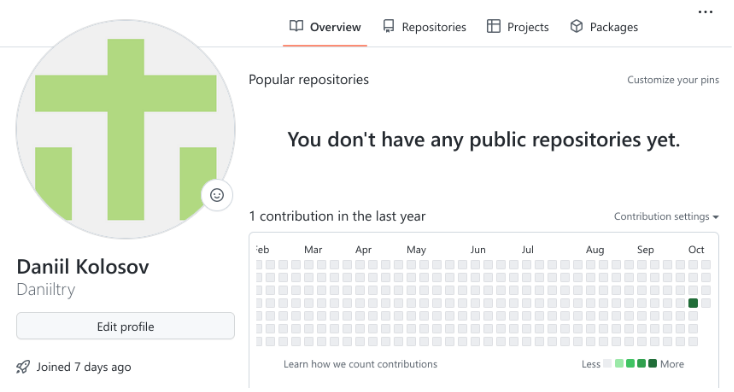
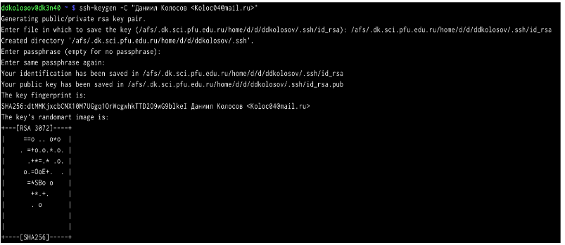
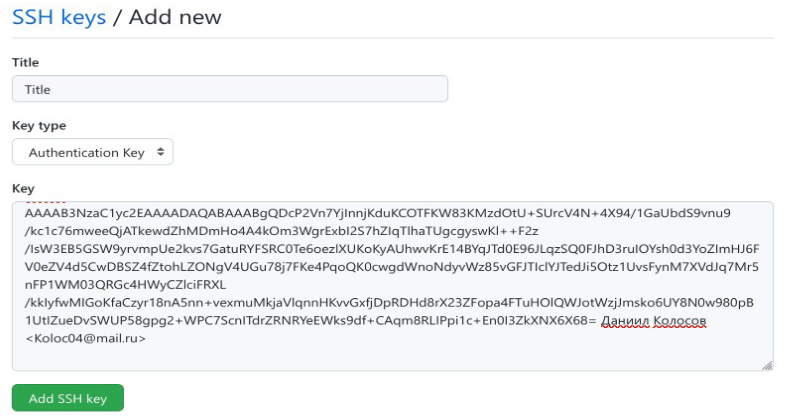
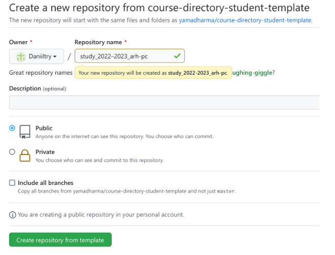
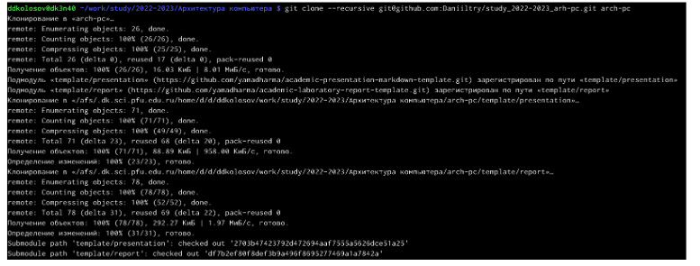
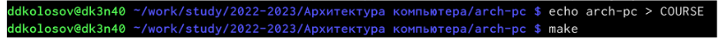
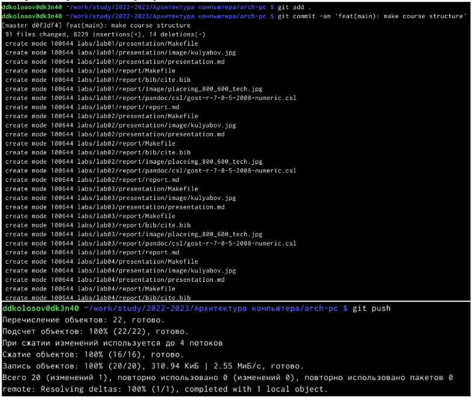
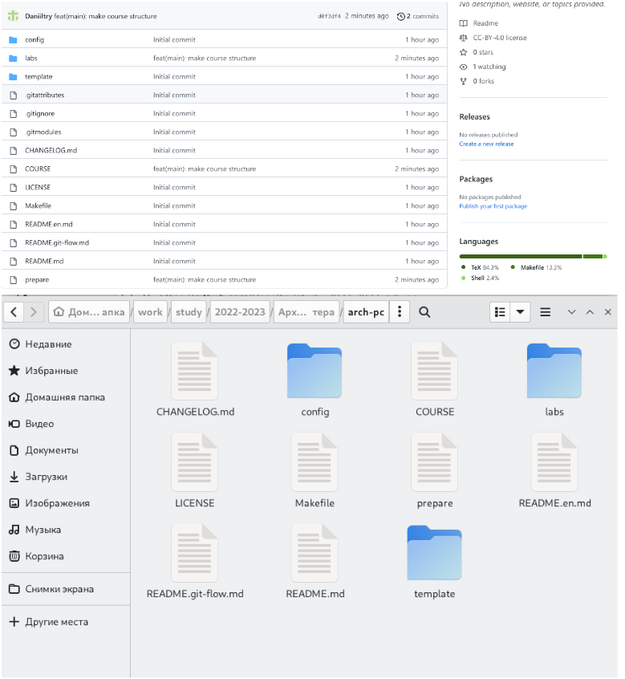
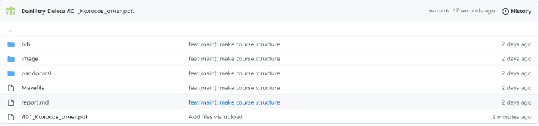

---
## Front matter
title: "Отчёта по лабораторной работе №2. Язык разметки
Markdown"
subtitle: "Арихитектура вычеслительных систем"
author: "Колосов Даниил Дмитриевич"

## Generic otions
lang: ru-RU
toc-title: "Содержание"

## Bibliography
bibliography: bib/cite.bib
csl: pandoc/csl/gost-r-7-0-5-2008-numeric.csl

## Pdf output format
toc: true # Table of contents
toc-depth: 2
lof: true # List of figures
lot: true # List of tables
fontsize: 12pt
linestretch: 1.5
papersize: a4
documentclass: scrreprt
## I18n polyglossia
polyglossia-lang:
  name: russian
  options:
	- spelling=modern
	- babelshorthands=true
polyglossia-otherlangs:
  name: english
## I18n babel
babel-lang: russian
babel-otherlangs: english
## Fonts
mainfont: PT Serif
romanfont: PT Serif
sansfont: PT Sans
monofont: PT Mono
mainfontoptions: Ligatures=TeX
romanfontoptions: Ligatures=TeX
sansfontoptions: Ligatures=TeX,Scale=MatchLowercase
monofontoptions: Scale=MatchLowercase,Scale=0.9
## Biblatex
biblatex: true
biblio-style: "gost-numeric"
biblatexoptions:
  - parentracker=true
  - backend=biber
  - hyperref=auto
  - language=auto
  - autolang=other*
  - citestyle=gost-numeric
## Pandoc-crossref LaTeX customization
figureTitle: "Рис."
tableTitle: "Таблица"
listingTitle: "Листинг"
lofTitle: "Список иллюстраций"
lotTitle: "Список таблиц"
lolTitle: "Листинги"
## Misc options
indent: true
header-includes:
  - \usepackage{indentfirst}
  - \usepackage{float} # keep figures where there are in the text
  - \floatplacement{figure}{H} # keep figures where there are in the text
---

# Цель работы

Целью работы является изучить идеологию и
применение средств контроля
версий. Приобрести практические навыки по работе с системой
git.

# Задание

1. Создайте отчет по выполнению лабораторной работы в соответствующем
каталоге рабочего пространства (labs>lab03>report).
2. Скопируйте отчеты по выполнению предыдущих лабораторных работ в
соответствующие каталоги созданного рабочего пространства.
3. Загрузите файлы на github.

# Выполнение лабораторной работы
2.4.1. Настройка github.
Перед выполнением работы зайдем на сайт https://github.com/ и
создадим учетную запись и заполним все требуемые данные

{ #fig:001 width=90% }

Далее можем приступать к выполнению лабораторной работы.
Задание 2.4.2. Базовая настройка git
Сначала сделаем предварительную конфигурацию git. Откроем
терминал и введем следующие команды, указав имя и email:

{ #fig:002 width=90% }

Дальше настраиваем utf-8 в выводе сообщений git:

{ #fig:003 width=90% }
Даниил Бойко
После зададим имя начальной ветки (будем называть её master):

{ #fig:004 width=90% }

Параметр autocrlf:

{ #fig:005 width=90% }
Даниил Бойко
Параметр safecrlf:

{ #fig:006 width=90% }

Задание 2.4.3. Создание SSH ключа
Для начала необходимо сгенерировать пару ключей. Ключи сохраняться в
каталоге ~/.ssh/

{ #fig:007 width=90% }

Далее необходимо загрузить сгенерированный открытый ключ. Для этого
заходим на сайт https://github.com/ под своей учётной записью и перейдем в
меню Setting. После этого выбрать в боковом меню SSH and GPG keys и
нажать кнопку New SSH key .

{ #fig:008 width=90% }

Вставляем ключ в появившееся на сайте поле и указываем для ключа имя
(Title).

{ #fig:009 width=90% }

Задание 2.4.4. Сознание рабочего пространства и репозитория курса на
основе шаблона
Открываем терминал и создаем каталог для предмета «Архитектура
компьютера»

{ #fig:010 width=90% }

Задание 2.4.5. Создание репозитория курса на основе шаблона
Перейдем на станицу репозитория с шаблоном курса https://github.com/yam
adharma/course-directory-student-template. Далее выберем Use this template.

{ #fig:011 width=90% }

Далее в открывшемся окне задайте имя репозитория (Repository name)
study_2022–2023_arh-pc и создайте репозиторий (кнопка Create repository
from template).

{ #fig:012 width=90% }

Далее откроем терминал и перейдем в каталог курса:

{ #fig:013 width=90% }

Потом клонируем созданный репозиторий
Ссылку для клонирования можно скопировать на странице созданного
репозитория Code -> SSH:

{ #fig:014 width=90% }

Задание 2.4.6. Настройка каталога курса
Перейдем в каталог курса:

{ #fig:015 width=90% }

Удалим лишние файлы:

{ #fig:016 width=90% }

Создадим необходимые каталоги:

{ #fig:017 width=90% }

Отправим файлы на сервер:

{ #fig:018 width=90% }

Далее проверим правильность создания иерархии рабочего пространства в
локальном репозитории и на странице github.

{ #fig:019 width=90% }

Ссылка на github: https://github.com/Daniiltry
Задание 2.5
1. Создаём отчёт по выполнению лабораторной работы в соответствующем
каталоге рабочего пространства (labs>lab03>report).
Ссылка на github: https://github.com/Daniiltry/study_2022-2023_arh-pc
2. Скопирем отчёты по выполнению предыдущих лабораторных работ в
соответствующие каталоги созданного рабочего пространства.

{ #fig:020 width=90% }

Загрузим файл на github

# Выводы

В ходе выполнения лабораторной работы No 2 я изучил идеологию и
применение средств контроля версий. Приобрёл практические навыки по
работе с системой git.

