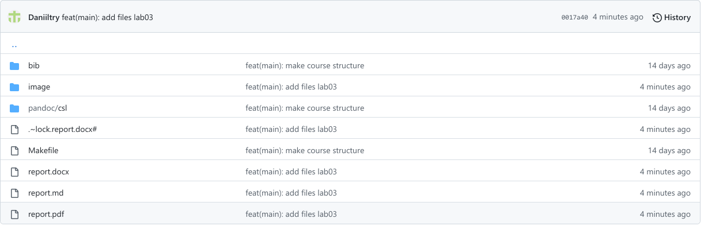

---
## Front matter
title: "Отчёта по лабораторной работе №3. Язык разметки
Markdown"
subtitle: "Арихитектура вычеслительных систем"
author: "Колосов Даниил Дмитриевич. НБИбд-02-22."

## Generic otions
lang: ru-RU
toc-title: "Содержание"

## Bibliography
bibliography: bib/cite.bib
csl: pandoc/csl/gost-r-7-0-5-2008-numeric.csl

## Pdf output format
toc: true # Table of contents
toc-depth: 2
lof: true # List of figures
lot: true # List of tables
fontsize: 12pt
linestretch: 1.5
papersize: a4
documentclass: scrreprt
## I18n polyglossia
polyglossia-lang:
 name: russian
 options:
 - spelling=modern
 - babelshorthands=true
polyglossia-otherlangs:
 name: english
## I18n babel
babel-lang: russian
babel-otherlangs: english
## Fonts
mainfont: PT Serif
romanfont: PT Serif
sansfont: PT Sans
monofont: PT Mono
mainfontoptions: Ligatures=TeX
romanfontoptions: Ligatures=TeX
sansfontoptions: Ligatures=TeX,Scale=MatchLowercase
monofontoptions: Scale=MatchLowercase,Scale=0.9
## Biblatex
biblatex: true
biblio-style: "gost-numeric"
biblatexoptions:
 - parentracker=true
 - backend=biber
 - hyperref=auto
 - language=auto
 - autolang=other*
 - citestyle=gost-numeric
## Pandoc-crossref LaTeX customization
figureTitle: "Рис."
tableTitle: "Таблица"
listingTitle: "Листинг"
lofTitle: "Список иллюстраций"
lotTitle: "Список таблиц"
lolTitle: "Листинги"
## Misc options
indent: true
header-includes:
 - \usepackage{indentfirst}
 - \usepackage{float} # keep figures where there are in the text
 - \floatplacement{figure}{H} # keep figures where there are in the text
---

# Цель работы

Целью работы является освоение процедуры оформления отчетов с помощью
легковесного языка разметки Markdown.

# Задание
1. В соответствующем каталоге сделайте отчёт по лабораторной работе No 3
в формате Markdown. В качестве отчёта необходимо предоставить отчёты
в 3 форматах: pdf, docx и md.
2. Загрузите файлы на github.

# Выполнение лабораторной работы
1. Открываем терминал

2. Перейдем в каталог курса сформированный при выполнении лаборатор-
ной работы No3

{ #fig:001 width=90% }

Обновим локальный репозиторий, скачав изменения из удаленного репози-
тория с помощью команды

{ #fig:002 width=90% }

3. Перейдем в каталог с шаблоном отчета по лабораторной работе No 3

{ #fig:003 width=90% }

4. Проведем компиляцию шаблона с использованием Makefile. Для этого
введём команду

{ #fig:004 width=90% }

При успешной компиляции должны сгенерироваться файлы report.pdf и
report.docx. Откроем и проверим корректность полученных файлов.

5. Удалим полученные файлы с использованием Makefile. Для этого введем
команду

{ #fig:005 width=90% }

Проверим, что после этой команды файлы report.pdf и report.docx были
удалены

6. Откроем файл report.md c помощью любого текстового редактора, на-
пример gedit

{ #fig:006 width=90% }

7. Заполнили отчет

{ #fig:007 width=80% }

8. Загружаем на github отчет

{ #fig:008 width=80% }

{ #fig:009 width=80% }

# Вывод

Я научился косвенно состовлять отчет с помощью
легковесного языка разметки Markdown

::: {#refs}
:::
