---
## Front matter
title: "Лабораторная работа No5"
subtitle: "Основы работы с
Midnight Commander (mc). Структура
программы на языке ассемблера NASM.
Системные вызовы в ОС GNU Linux"
author: "Колосов Даниил Дмитриевич"

## Generic otions
lang: ru-RU
toc-title: "Содержание"

## Bibliography
bibliography: bib/cite.bib
csl: pandoc/csl/gost-r-7-0-5-2008-numeric.csl

## Pdf output format
toc: true # Table of contents
toc-depth: 2
lof: true # List of figures
lot: true # List of tables
fontsize: 12pt
linestretch: 1.5
papersize: a4
documentclass: scrreprt
## I18n polyglossia
polyglossia-lang:
  name: russian
  options:
	- spelling=modern
	- babelshorthands=true
polyglossia-otherlangs:
  name: english
## I18n babel
babel-lang: russian
babel-otherlangs: english
## Fonts
mainfont: PT Serif
romanfont: PT Serif
sansfont: PT Sans
monofont: PT Mono
mainfontoptions: Ligatures=TeX
romanfontoptions: Ligatures=TeX
sansfontoptions: Ligatures=TeX,Scale=MatchLowercase
monofontoptions: Scale=MatchLowercase,Scale=0.9
## Biblatex
biblatex: true
biblio-style: "gost-numeric"
biblatexoptions:
  - parentracker=true
  - backend=biber
  - hyperref=auto
  - language=auto
  - autolang=other*
  - citestyle=gost-numeric
## Pandoc-crossref LaTeX customization
figureTitle: "Рис."
tableTitle: "Таблица"
listingTitle: "Листинг"
lofTitle: "Список иллюстраций"
lotTitle: "Список таблиц"
lolTitle: "Листинги"
## Misc options
indent: true
header-includes:
  - \usepackage{indentfirst}
  - \usepackage{float} # keep figures where there are in the text
  - \floatplacement{figure}{H} # keep figures where there are in the text
---

# Цель работы

Приобретение практических навыков работы в Midnight Commander. Освоение
инструкций языка ассемблера mov и int.

# Задание

1. Создайте копию файла lab5-1.asm. Внесите изменения в программу (без
использования внешнего файла in_out.asm), так чтобы она работала по
следующему алгоритму:
• вывести приглашение типа “Введите строку:”;
• ввести строку с клавиатуры;
• вывести введённую строку на экран.
2. Получите исполняемый файл и проверьте его работу. На приглашение
ввести строку введите свою фамилию.
3. Создайте копию файла lab5-2.asm. Исправьте текст программы с исполь-
зование подпрограмм из внешнего файла in_out.asm, так чтобы она ра-
ботала по следующему алгоритму:
• вывести приглашение типа “Введите строку:”;
• ввести строку с клавиатуры;
• вывести введённую строку на экран.
4. Создайте исполняемый файл и проверьте его работу.

# Выполнение лабораторной работы

1. Откройте Midnight Commander 

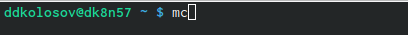{ #fig:001 width=90% }

2. Перейдем в каталог ~/work/arch-pc созданный при выполнении лабораторной работы No5. 
С помощью функциональной создаем папку lab05. 
Пользуясь строкой ввода и командой touch создаем файл lab5-1.asm

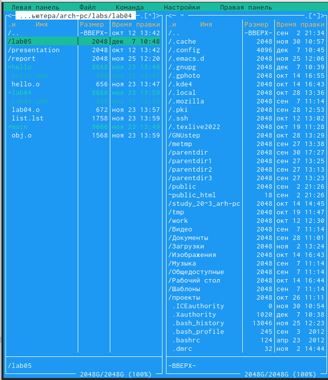{ #fig:002 width=90% }

3. С помощью функциональной клавиши F4 откроем файл lab5-1.asm для редактирования во встроенном редакторе.
Введите текст программы из листинга 6.1

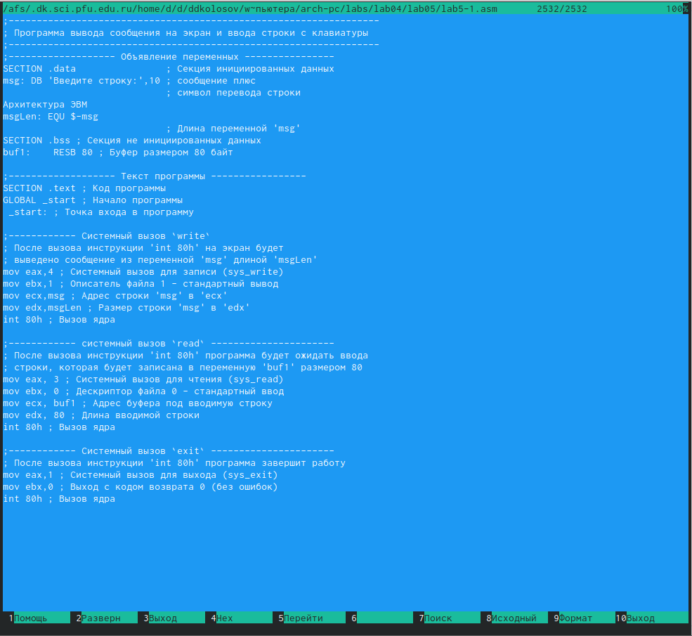{ #fig:003 width=90% }

4. С помощью функциональной клавиши F3 откроем файл lab5-1.asm для
просмотра. Убедимся, что файл содержит текст программы.
Оттранслируем текст программы lab5-1.asm в объектный файл. Выполним компоновку объектного файла и запустим получившийся исполняемый файл. 

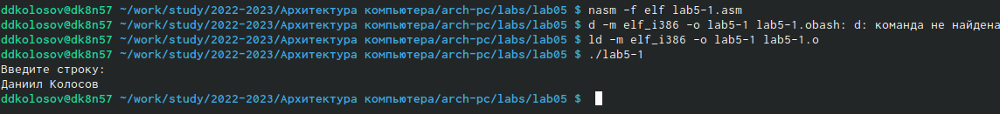{ #fig:004 width=90% }

5. Скачаем файл in_out.asm со страницы курса в ТУИС.

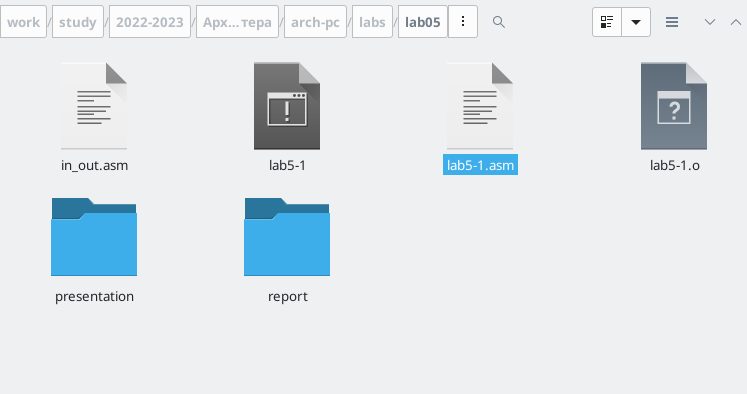{ #fig:005 width=90% }

6. Создаем копию

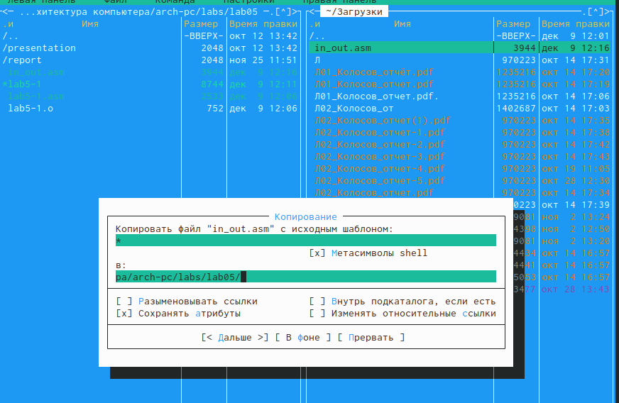{ #fig:006 width=90% }

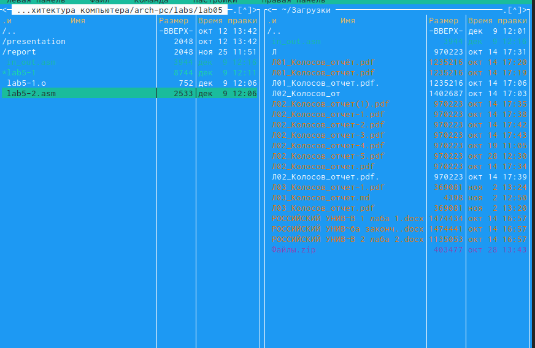{ #fig:007 width=90% }

7. В файле lab5-2.asm замените подпрограмму sprintLF на sprint. Создай-
те исполняемый файл и проверьте его работу. 

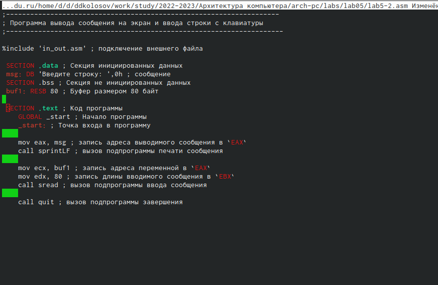{ #fig:008 width=90% }

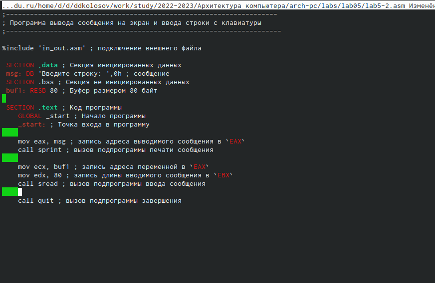{ #fig:009 width=90% }

1. Создаем копию. Вносим изменения в программу. 

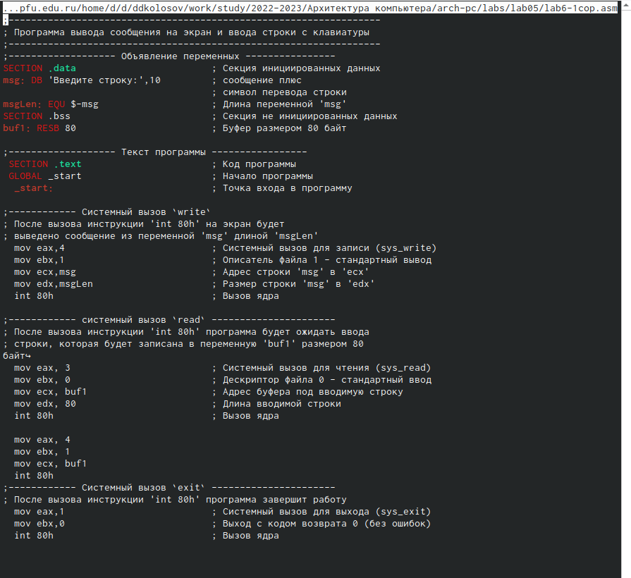{ #fig:010 width=90% }

2. Проверим его работу.

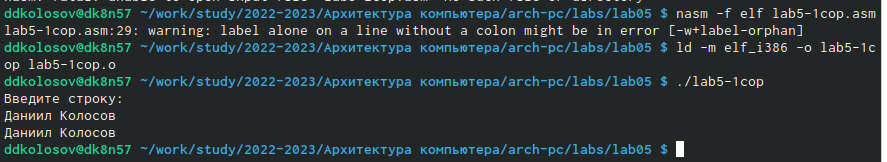{ #fig:011 width=90% }

3. Создаем копию. Вносим изменения в программу, для второго файла.

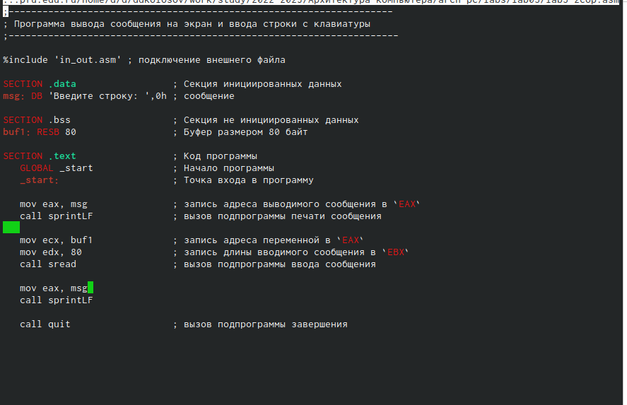{ #fig:012 width=90% }

4. Проверим его работу.

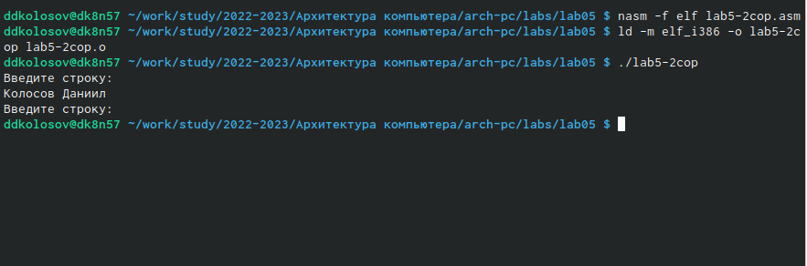{ #fig:013 width=90% }

# Выводы

Я приобрел практические навыки работы в  Midnight Commander. 

# Список литературы{.unnumbered}

::: {#refs}
:::
