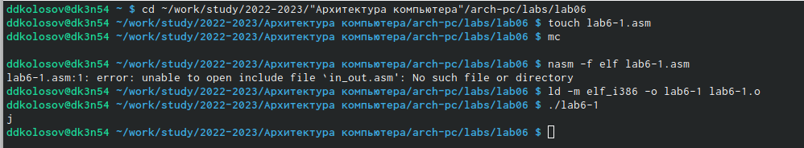
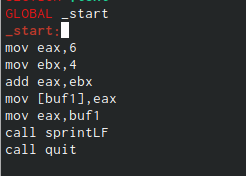
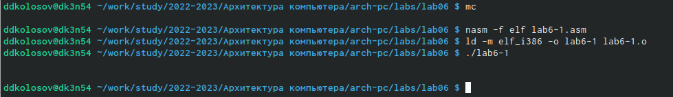
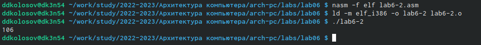
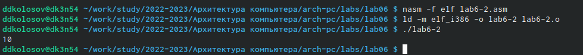
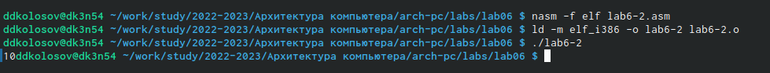
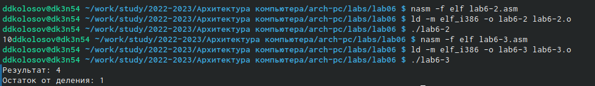
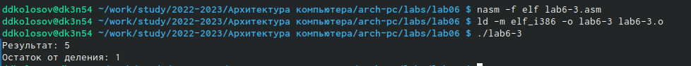
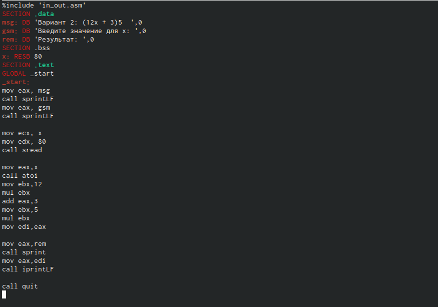
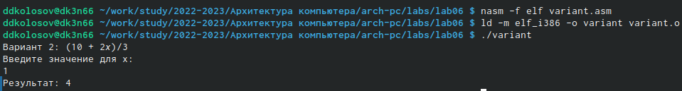

---
## Front matter
title: "Отчёт по лабораторной работе 6"
subtitle: "Архитектура вычислительных систем"
author: "Колосов Даниил Дмитриевич"

## Generic otions
lang: ru-RU
toc-title: "Содержание"

## Bibliography
bibliography: bib/cite.bib
csl: pandoc/csl/gost-r-7-0-5-2008-numeric.csl

lot: true # List of tables
fontsize: 12pt
linestretch: 1.5
papersize: a4
documentclass: scrreprt
## I18n polyglossia
polyglossia-lang:
  name: russian
  options:
	- spelling=modern
	- babelshorthands=true
polyglossia-otherlangs:
  name: english
## I18n babel
babel-lang: russian
babel-otherlangs: english
## Fonts
mainfont: PT Serif
romanfont: PT Serif
sansfont: PT Sans
monofont: PT Mono
mainfontoptions: Ligatures=TeX
romanfontoptions: Ligatures=TeX
sansfontoptions: Ligatures=TeX,Scale=MatchLowercase
monofontoptions: Scale=MatchLowercase,Scale=0.9
## Biblatex
biblatex: true
biblio-style: "gost-numeric"
biblatexoptions:
  - parentracker=true
  - backend=biber
  - hyperref=auto
  - language=auto
  - autolang=other*
  - citestyle=gost-numeric
## Pandoc-crossref LaTeX customization
figureTitle: "Рис."
tableTitle: "Таблица"
listingTitle: "Листинг"
lofTitle: "Список иллюстраций"
lotTitle: "Список таблиц"
lolTitle: "Листинги"
## Misc options
indent: true
header-includes:
  - \usepackage{indentfirst}
  - \usepackage{float} # keep figures where there are in the text
  - \floatplacement{figure}{H} # keep figures where there are in the text
---

# Цель работы

Освоение арифметических инструкций языка ассемблера NASM.

# Задание

1. Написать программу вычисления выражения 𝑦 = 𝑓(𝑥). Программа должна
выводить выражение для вычисления, выводить запрос на ввод значения
𝑥, вычислять заданное выражение в зависимости от введенного 𝑥, выво-
дить результат вычислений. Вид функции 𝑓(𝑥) выбрать из таблицы 6.3
вариантов заданий в соответствии с номером полученным при выполне-
нии лабораторной работы. Создайте исполняемый файл и проверьте его
работу для значений 𝑥1 и 𝑥2 из 6.3.

# Выполнение лабораторной работы

1. Создаем каталог для программам лабораторной работы No 6, перейдем в
него и создадим файл lab6-1.asm:
Вводим код и выводим ответ:

{ #fig:001 width=90% }

2. Далее заходим в код и убираем ковычки
 
{ #fig:002 width=90% }

3. Выводим на экран

{ #fig:003 width=90% }

4. Создаем файл lab6-2.asm в каталоге ~/work/arch-pc/lab06 и вводим в него
текст программы из листинга 7.2.
Выводим ответ:

{ #fig:004 width=90% }

5. Далее заходим в код и убираем ковычки

{ #fig:005 width=90% }

6. Далее заходим в код и смотрим на различие iprintLF и iprint

{ #fig:006 width=90% }

7. Создайте файл lab6-3.asm в каталоге ~/work/arch-pc/lab06:
И выводим:

{ #fig:007 width=90% }

8. Изменяем и выводим:

{ #fig:008 width=90% }

9. Далее создаем файл variant.asm
Заходим, вставляем и выводим:

{ #fig:009 width=90% }

10. Ответы на вопросы 

1. Какие строки листинга 7.4 отвечают за вывод на экран сообщения 'Ваш
вариант:'?

Ответ: 
mov eax,rem
call sprint

2. Для чего используется следующие инструкции? nasm mov ecx, x mov edx, 80 call sread

Ответ: 
nasm - переход к языку ассемблера
mov ecx, x - присвоение значения x переменной ecх
mov edx, 80 - присвоение значение 80 переменной edx
call sread - для считывания в перемнную какого то числа

3. Для чего используется инструкция 'call atoi'?

Ответ:
Конвертирует строку, на которую указывает параметр str, в величину типа int

4. Какие строки листинга 7.4 отвечают за вычисления варианта?

Ответ:
xor edx,edx
mov ebx,20
div ebx
inc edx

5. В какой регистр записывается остаток от деления при выполнении ин-
струкции 'div ebx'?

Ответ:
Остаток запишется в регистр dx

6. Для чего используется инструкция 'inc edx'?

Ответ: Это инкремент для прибавления единицы к переменной

7. Какие строки листинга 7.4 отвечают за вывод на экран результата вычис-
лений?

Ответ: 
mov eax,rem
call sprint
mov eax,edx
call iprintLF

11. Вариант 2 
Решение:

{ #fig:010 width=90% }

{ #fig:011 width=90% }

{ #fig:012 width=90% }

# Выводы

Я освоил арифметических инструкций языка ассемблера NASM.

::: {#refs}
:::
